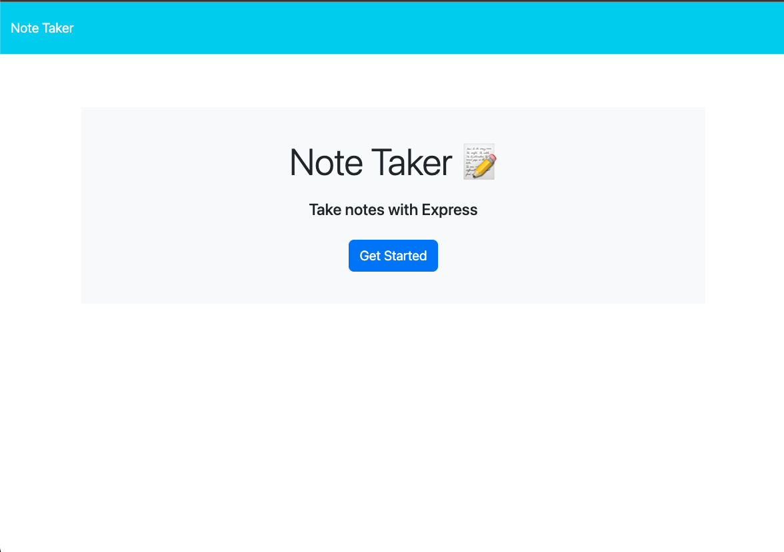
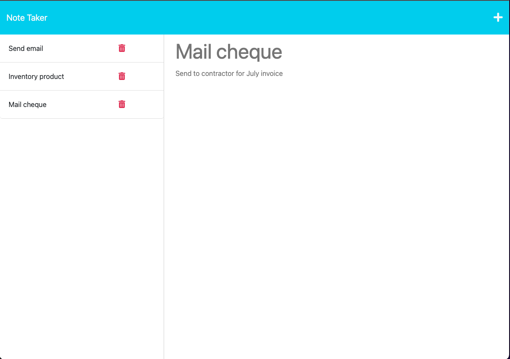

# <Note-Taker>

## Description

This app allows the user to make and save notes. Previously saved notes appear on the left side of the application. Clicking on a note lets the user see the full note text. Finally, notes can be deleted by clicking the icon.

## Installation

The app is deployed on Heroku here:

## Usage

Click on the "Get Started" button to access the note creation/viewing page.
Click on the "Note Title" and "Note Text" fields to enter a new note. When you're done, click on the save icon in the top right corner to add it to the list of saved notes.
Click on the list of saved notes on the left to see the full text of the note.
Click on the + icon at the top right at any time to start a new note.
Click on the delete icon next to any saved note to delete it.

## Credits

N/A

## License

Please refer to the license in this repository.

